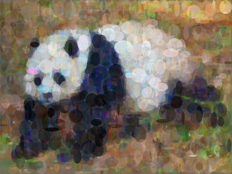
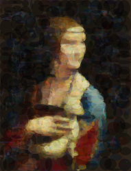
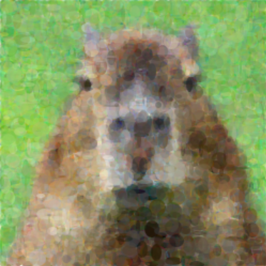
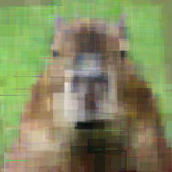
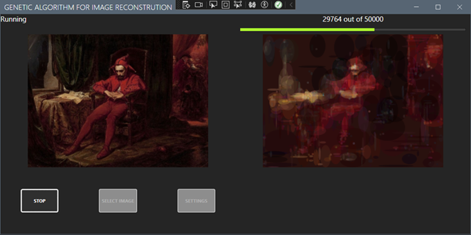
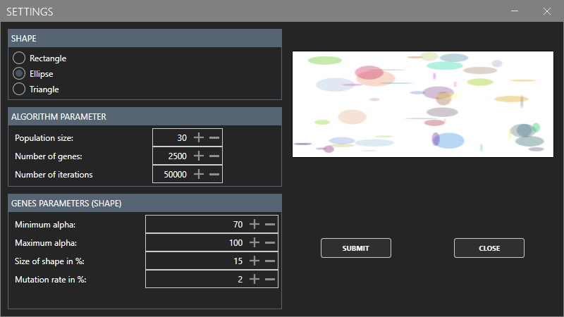

# Genetic Algorithm For Image Recreation
This project uses a Genetic Algorithm to recreate images using simple geometric primitives such as circles, rectangles, and triangles. The algorithm evolves a population of candidate solutions over time to approximate the target image.
## Tech stack
- C# - core logic
- WPF - gui representation
- Genetic Algorithm - custom implementation 
- Image processing - bitmap comparison

## Libraries
- **MahApps.Metro** – modern UI components for WPF  
- **CsvHelper** – exporting experiment / result data  
- **Aspose.SVG** – SVG rendering and export  

### Requirements
- .NET 8.0
- Windows (WPF)

## Installation
1. Clone repo:
   git clone https://github.com/KacperMichalak2002/Genetic-Algorithm-For-Image-Recreation

2. Open solution in Visual Studio

3. Build and run (F5)

## Usage
1. Load source image
2. Select primitive type (circles / rectangles / triangles)
3. Adjust parameters
4. Run algorithm

## Algorithm workflow

1. **Initialization**  
   A population of random individuals is generated. Each individual consists of a set of geometric primitives (circles, rectangles, or triangles) with random position, size, color, and transparency.

2. **Rasterization**  
   Each individual is converted from vector representation (shapes) into a bitmap image to allow pixel-by-pixel comparison.

3. **Fitness Evaluation**  
   Individuals are evaluated using a fitness function based on visual similarity to the target image.  
   The algorithm uses **CIEDE2000 color difference**, which better reflects human color perception than simple RGB comparison.

4. **Selection**  
   The best individuals are selected using **tournament selection**.  
   Additionally, **elitism** is applied — top-performing individuals are preserved between generations.

5. **Crossover**  
   New individuals are created using **uniform crossover**, where each gene has an equal chance of being inherited from either parent.

6. **Mutation**  
   Random modifications are applied to maintain diversity and explore new solutions:
   - adding/removing shapes  
   - changing color, position, size, transparency  

   The mutation intensity adapts dynamically based on algorithm stagnation.

7. **Iteration**  
   Steps 2–6 are repeated until a satisfactory result is achieved or the maximum number of iterations is reached.

## Results
Below are examples of images reconstructed using different primitive types:

   
  <i>Panda recreation using ellipses</i>

   
  <i>"Lady with an Ermine" recreation using ellipses</i>

   
  <i>Capybara recreation using ellipses</i>

   
  <i>Capybara recreation using rectangles</i>

## GUI

   
  <i>Main application window</i>

   
  <i>Algorithm settings view</i>

## Parameters
- **Population Size** – number of individuals per generation  
- **Number of Genes** – controls image complexity  
- **Number of Iterations** – total number of algorithm iterations  
- **Minimum Alpha** – minimum opacity of generated shapes  
- **Maximum Alpha** – maximum opacity of generated shapes  
- **Shape Size** – maximum percentage of image area a single shape can cover  
- **Mutation Rate** – probability of mutation  

